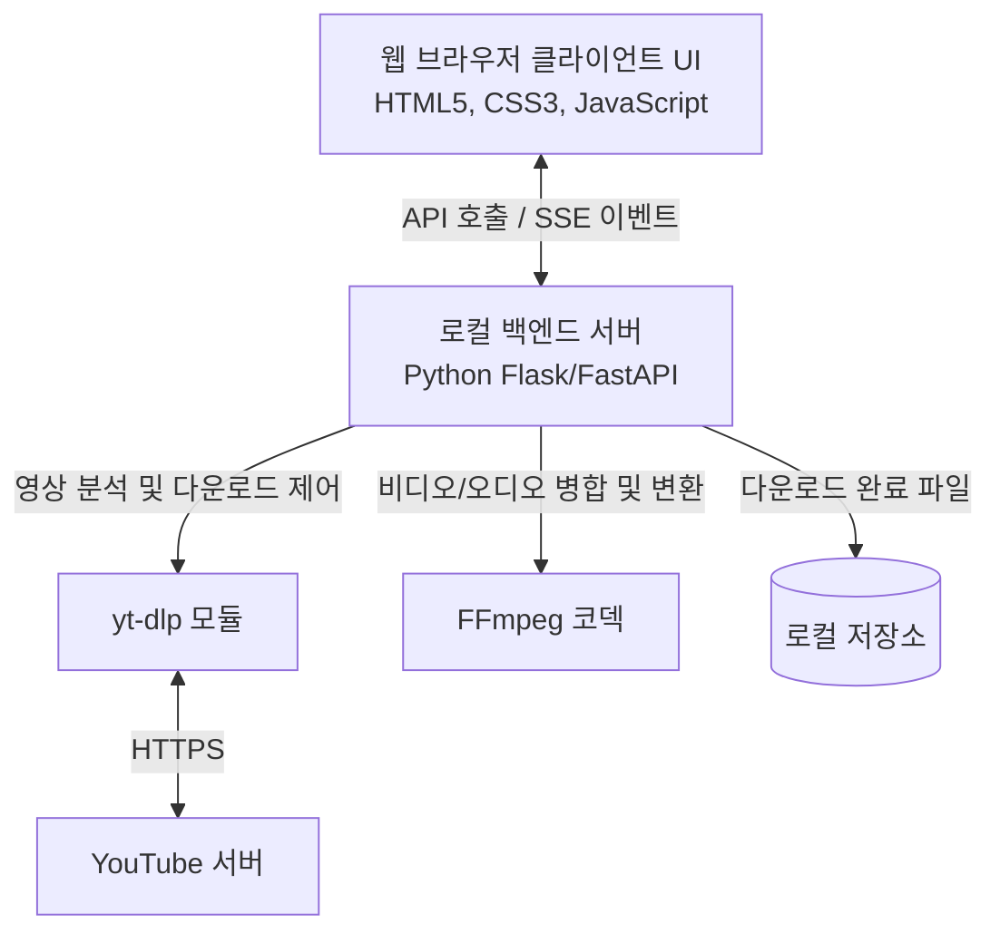

# 제품 요구사항 정의서 (PRD) - 한국어 버전 유튜브 다운로더 (YouTube Downloader)

본 문서는 오픈소스 미디어 다운로더인 [Hitomi-Downloader](https://github.com/KurtBestor/Hitomi-Downloader)의 핵심 특징 및 성능 모델을 분석하고, 이를 벤치마킹하여 사용자 친화적인 한국어 버전의 유튜브 다운로더(YouTube Downloader) 제품 요구사항을 정의합니다.

---

## 1. 개요 (Overview)

### 1.1 프로젝트 배경 및 목적
*   **배경**: Hitomi-Downloader는 강력한 다운로드 속도(멀티스레딩)와 다양한 사이트 지원 기능을 갖춘 오픈소스 데스크톱 다운로더입니다. 그러나 복잡한 다기능 제공으로 인해 유튜브 다운로드만을 원하는 라이트 유저에게는 UI가 다소 복잡하고 진입 장벽이 있을 수 있습니다.
*   **목적**: Hitomi-Downloader의 강력한 다운로드 아키텍처(멀티스레딩, 대기열 관리, 품질 최적화)를 계승하되, 한국 사용자가 가장 많이 필요로 하는 **유튜브 다운로드 기능에 집중**하여, 세련되고 직관적인 UX를 갖춘 한국어 유튜브 다운로더 프로그램을 개발합니다.

### 1.2 제품 비전
"단 한 번의 클릭으로 가장 빠르고 아름답게 유튜브 동영상 및 음원을 소장하는 솔루션"

---

## 2. Hitomi-Downloader 분석 및 벤치마킹 요소

Hitomi-Downloader의 주요 강점 분석을 통해 본 프로젝트에 적용할 핵심 요소를 도출합니다.

| 벤치마킹 영역 | Hitomi-Downloader 특징 | 유튜브 다운로더 적용 계획 |
| :--- | :--- | :--- |
| **다운로드 성능** | 멀티스레드 다운로드 지원으로 빠른 속도 제공 | `yt-dlp` 기반의 조각 다운로드 및 멀티스레드 병합 처리 구현 |
| **다운로드 대기열** | 대기열 등록, 개별 진행률 표시, 중지/재개/삭제 기능 | 대기열 기반 UI 구현, 직관적인 상태(대기/진행 중/완료/실패) 시각화 |
| **입력 편의성** | 클립보드 모니터링을 통한 자동 URL 인식 | 입력 창에 붙여넣기 시 자동으로 비디오 정보 파싱 및 다운로드 준비 |
| **설정 다양성** | 저장 경로 변경, 테마(다크 모드), 동시 다운로드 제한 등 | 저장 경로 선택, 비디오/오디오 포맷 기본 설정, 동시 다운로드 개수 제어 |

---

## 3. 제품 요구사항 (Product Requirements)

### 3.1 기능적 요구사항 (Functional Requirements)

#### F-01: 유튜브 URL 분석 및 정보 파싱
*   **상세 설명**: 사용자가 유튜브 비디오, 쇼츠(Shorts), 플레이리스트(Playlist) URL을 입력하면 실시간으로 해당 미디어 정보를 파싱합니다.
*   **출력 정보**: 비디오 제목, 썸네일 이미지, 영상 길이(재생시간), 지원 해상도 목록(1080p, 720p, 480p 등) 및 오디오 추출 옵션.
*   **예외 처리**: 잘못된 URL이나 비공개 영상인 경우 한국어로 적절한 안내 메시지 표시.

#### F-02: 대기열 및 멀티스레드 다운로드
*   **상세 설명**: 여러 개의 다운로드 작업을 대기열에 추가하고 순차적 혹은 동시에 다운로드합니다.
*   **세부 제어**: 작업 일시정지, 재개, 취소, 개별 작업 삭제 기능 제공.
*   **속도 제어**: 백엔드 동시 다운로드 개수를 제한(기본 2개, 최대 5개)하여 네트워크 병목 방지.

#### F-03: 다양한 출력 포맷 및 화질 선택
*   **비디오**: MP4 형식으로 최대 고화질(1080p, 1440p, 2160p 4K 등) 다운로드 지원. (FFmpeg을 이용해 고화질 비디오와 오디오 병합)
*   **오디오**: MP3 혹은 M4A 포맷으로 음원만 추출하는 기능 지원.

#### F-04: 로컬 저장 경로 및 편리한 파일 확인
*   **상세 설명**: 다운로드 완료 후 사용자가 다운로드된 파일 위치로 바로 이동할 수 있는 '폴더 열기' 버튼 제공.
*   **설정 변경**: 사용자가 원하는 기본 다운로드 저장 경로를 브라우저 혹은 설정을 통해 변경 가능.

#### F-05: 세련된 테마 및 한국어 UI 지원
*   **상세 설명**: 직관적인 한국어 UI 제공. 시스템 설정을 감지하거나 수동으로 전환 가능한 고품격 다크 모드 및 라이트 모드 지원.

---

### 3.2 비기능적 요구사항 (Non-Functional Requirements)

#### N-01: 시각적 완성도 및 애니메이션 (Aesthetics)
*   **디자인**: 현대적이고 트렌디한 디자인(예: Sleek Dark 테마, Gradient Accent Color, Glassmorphism 효과).
*   **애니메이션**: 다운로드 진행률을 부드러운 Progress Bar 애니메이션으로 표현, 마우스 호버 효과 및 마이크로 인터랙션을 통해 생동감 부여.

#### N-02: 이식성 및 실행 편의성
*   **실행 방식**: 데스크톱 환경(macOS)에서 간단한 스크립트 실행만으로 브라우저 기반 GUI가 실행되는 하이브리드 웹앱 형태(Local Web UI). 
*   **의존성**: Python 3 환경에서 구동되며 필요한 핵심 라이브러리(`yt-dlp`, `Flask` 등)는 자동 설치 또는 원클릭 스크립트로 구성.

#### N-03: 업데이트 대응력
*   **유튜브 차단 대응**: 유튜브의 스크립트 변경으로 인한 다운로드 실패에 대응하여, 주기적으로 `yt-dlp` 모듈을 자동/수동 업데이트할 수 있는 구조 마련.

---

## 4. 시스템 아키텍처 및 기술 스택

*   **Frontend**: HTML5, CSS3 (고급 다크모드, 글래스모피즘, 부드러운 애니메이션), Vanilla JS (상태 관리 및 비동기 통신).
*   **Backend**: Python (Flask) - 가볍고 이식성이 좋으며, `yt-dlp` 모듈과의 연동이 매우 매끄러움.
*   **Core Engine**: `yt-dlp` (유튜브 영상 다운로드의 글로벌 표준 엔진).
*   **Media Processing**: `FFmpeg` (고화질 비디오/오디오 병합 및 MP3 오디오 추출용).

---

## 5. 사용자 화면 구성 및 UX 흐름

1.  **메인 대시보드**:
    *   상단에 유튜브 주소 입력란과 '분석/추가' 버튼 배치.
    *   자동 클립보드 확인 기능 제공 (선택 사항).
2.  **화질/포맷 선택 모달**:
    *   URL 분석 완료 시 등장. 비디오(화질별) 및 오디오(음질별) 선택 옵션 제공.
3.  **다운로드 대기열 영역**:
    *   하단 영역에 추가된 다운로드 목록이 카드 형태로 나열됨.
    *   각 카드에는 썸네일, 제목, 진행 상태(진행률 %, 속도, 남은 시간), 제어 버튼(일시정지/삭제) 포함.
4.  **설정 패널**:
    *   기본 저장 경로 설정, 동시 다운로드 제한 수량 설정, 테마 선택.
